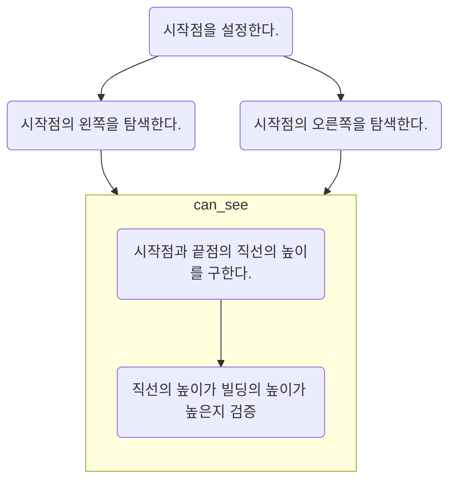

## 1027: 고층 건물

### 링크

- https://www.acmicpc.net/problem/1027

### 문제

세준시에는 고층 빌딩이 많다. 세준시의 서민 김지민은 가장 많은 고층 빌딩이 보이는 고층 빌딩을 찾으려고 한다. 빌딩은 총 N개가 있는데, 빌딩은 선분으로 나타낸다. i번째 빌딩 (1부터 시작)은 (i,0)부터 (i,높이)의 선분으로 나타낼 수 있다. 고층 빌딩 A에서 다른 고층 빌딩 B가 볼 수 있는 빌딩이 되려면, **두 지붕을 잇는 선분이 A와 B를 제외한 다른 고층 빌딩을 지나거나 접하지 않아야 한다.** 가장 많은 고층 빌딩이 보이는 빌딩을 구하고, 거기서 보이는 빌딩의 수를 출력하는 프로그램을 작성하시오.

#### 입력

첫째 줄에 빌딩의 수 N이 주어진다. N은 50보다 작거나 같은 자연수이다. 둘째 줄에 1번 빌딩부터 그 높이가 주어진다. 높이는 1,000,000,000보다 작거나 같은 자연수이다.

#### 출력

첫째 줄에 문제의 정답을 출력한다.

### 문제 분석

- 높이의 최댓값은 `1,000,000,000` 이므로 높이 기반의 탐색은 시간초과가 발생할 수 있다.
- 시작점과 끝점을 정의하여(A,B) 좌, 우를 탐색해야 한다.
- 시작점과 끝점에서 직선의 높이를 기반으로 탐색해야 한다. 이때 직선의 높이보다 높다면 가려진다.

### 풀이

