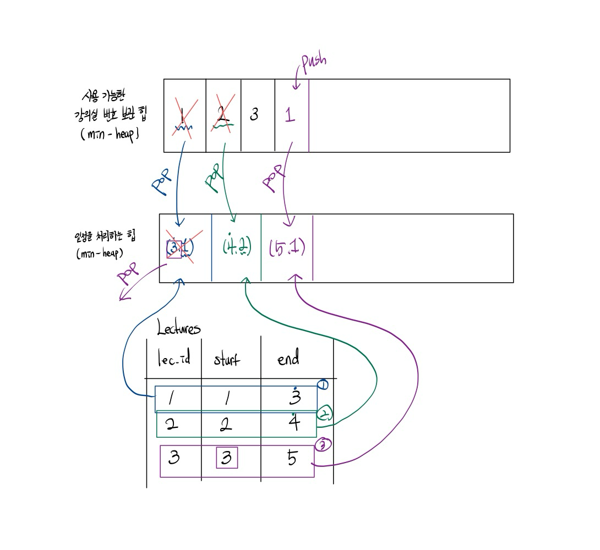

# [BOJ] 1379 강의실

## 문제 분석

### 링크

- https://www.acmicpc.net/problem/1379

### 문제

N개의 강의가 있다. 우리는 모든 강의의 시작하는 시간과 끝나는 시간을 알고 있다. 이때, **우리는 최대한 적은 수의 강의실을 사용하여 모든 강의가 이루어지게 하고 싶다.**
물론, 한 강의실에서는 동시에 2개 이상의 강의를 진행할 수 없고, 한 강의의 종료시간과 다른 강의의 시작시간이 겹치는 것은 상관없다. 필요한 최소 강의실 수 K와, 각 강의마다 강의실을 배정하는 프로그램을 작성하시오.

### 입력

첫째 줄에 강의의 개수 N(1 ≤ N ≤ 100,000)이 주어진다. 둘째 줄부터 N개의 줄에 걸쳐 각 줄마다 세 개의 정수가 주어지는데, 순서대로 강의 번호, 강의 시작 시간, 강의 종료 시간을 의미한다. 강의 번호는 1부터 N까지 붙어 있으며, 입력에서 꼭 순서대로 주어지지 않을 수 있으나 한 번씩만 주어진다. 강의 시작 시간과 강의 종료 시간은 0 이상 10억 이하의 정수이고, 시작 시간은 종료 시간보다 작다.

### 출력

첫째 줄에 필요한 최소 강의실 개수 K를 출력한다. 둘째 줄부터 N개의 줄에 걸쳐 각 강의에 배정할 강의실 번호를 순서대로 출력한다. 편의상 강의실 번호는 1, 2, ..., K 로 매긴다.

## 풀이

> **우리는 최대한 적은 수의 강의실을 사용하여 모든 강의가 이루어지게 하고 싶다.**

1. 촘촘하게 일정을 정렬해야 함 -> 빨리 시작하고 빨리 끝나는 것부터 처리해야 함
2. 기존에 할당된 강의실만으로 일정을 소화해야 함

### 자료구조&알고리즘 선정

- 일정을 처리하는 자료구조
  - 가장 빨리 끝나는 수업을 가져와야 함 -> `min-heap` 사용
  - 문제 요구사항 상 강의실 번호도 필요함 -> **(강의가 끝나는 시간, 강의실 번호)**
- 사용 가능한 강의실을 처리하는 자료구조
  - 어떻게 구현하냐에 따라서 사용되는 자료 구조가 다름
  1. 사용 가능한 모든 강의실(강의 개수) 중에서 가장 번호가 작은 것부터 처리하는 경우 -> `heap`
  2. 사용된 강의실만 처리하는 경우 -> `deque`

### 처리과정

> “사용 가능한 모든 강의실(강의 개수) 중에서 가장 번호가 작은 것부터 처리하는 경우”를 기준으로 문제를 해결하겠습니다.



핵심적인 로직은 아래와 같습니다.

1. 연속적으로 강의를 수행할 수 있는 경우
   - 연속적으로 처리 가능하다면 일정 처리 힙을 pop한다.
   - pop을 통해 얻은 강의실 번호를 사용 가능한 강의실 힙에 넣는다.
2. 사용 가능한 강의실을 활용하여 새로운 강의를 수행
   - 사용 가능한 강의실 힙에서 강의실 정보를 얻는다.
   - (종료 시점, 사용 가능한 강의실 번호)를 push한다.

### 시간복잡도

```math
O(NlogN)
```

### 코드

- [Python](./1379.py)

## 기타

- “사용된 강의실만 처리하는 경우”가 메모리, 속도 측면에서 더 효율적입니다.
