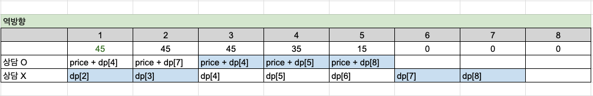

# 14501 퇴사

## 문제 분석

### 링크

- https://www.acmicpc.net/problem/14501

### 문제

상담원으로 일하고 있는 백준이는 퇴사를 하려고 한다.
오늘부터 N+1일째 되는 날 퇴사를 하기 위해서, 남은 N일 동안 최대한 많은 상담을 하려고 한다.
백준이는 비서에게 최대한 많은 상담을 잡으라고 부탁을 했고, 비서는 하루에 하나씩 서로 다른 사람의 상담을 잡아놓았다.
각각의 상담은 상담을 완료하는데 걸리는 기간 Ti와 상담을 했을 때 받을 수 있는 금액 Pi로 이루어져 있다.
N = 7인 경우에 다음과 같은 상담 일정표를 보자.

|        | **1일** | **2일** | **3일** | **4일** | **5일** | **6일** | **7일** |
| ------ | ------- | ------- | ------- | ------- | ------- | ------- | ------- |
| **Ti** | 3       | 5       | 1       | 1       | 2       | 4       | 2       |
| **Pi** | 10      | 20      | 10      | 20      | 15      | 40      | 200     |

1일에 잡혀있는 상담은 총 3일이 걸리며, 상담했을 때 받을 수 있는 금액은 10이다. 5일에 잡혀있는 상담은 총 2일이 걸리며, 받을 수 있는 금액은 15이다.
~상담을 하는데 필요한 기간은 1일보다 클 수 있기 때문에, 모든 상담을 할 수는 없다. 예를 들어서 1일에 상담을 하게 되면, 2일, 3일에 있는 상담은 할 수 없게 된다~. 2일에 있는 상담을 하게 되면, 3, 4, 5, 6일에 잡혀있는 상담은 할 수 없다.
또한, N+1일째에는 회사에 없기 때문에, 6, 7일에 있는 상담을 할 수 없다.
퇴사 전에 할 수 있는 상담의 최대 이익은 1일, 4일, 5일에 있는 상담을 하는 것이며, 이때의 이익은 10+20+15=45이다.
상담을 적절히 했을 때, **백준이가 얻을 수 있는 최대 수익**을 구하는 프로그램을 작성하시오.

### 입력

첫째 줄에 N (1 ≤ N ≤ 15)이 주어진다.
둘째 줄부터 N개의 줄에 Ti와 Pi가 공백으로 구분되어서 주어지며, 1일부터 N일까지 순서대로 주어진다. (1 ≤ Ti ≤ 5, 1 ≤ Pi ≤ 1,000)

### 출력

첫째 줄에 백준이가 얻을 수 있는 최대 이익을 출력한다.

## 풀이

### 포인트

- 최대한 수익 얻기

### 자료구조 & 알고리즘

- 일정에 따라서 수익의 최대값이 누적된다. -> DP를 활용
  - 마지막 일정이 1의 시간값을 가진다면 상담을 수행할 수 있음 -> DP 범위 0 ~ N + 1

### 풀이 과정

1. `N+1` 에서부터 0까지 **역방향**으로 탐색한다.
2. 조건을 비교하여 탐색하는 일정(A)의 최대 가격을 dp에 채운다.
   1. A에 상담을 수행한 경우
      - A 종료 이후에 수행한 가격과 A의 가격을 더한다.
   2. A에 상담을 수행하지 않은 경우
      - A 다음날(A+1)의 가격
3. dp의 맨 첫번째 값을 구한다.



### 코드

- [Python](./14501.py)

### 시간 복잡도

```math
O(N)
```
